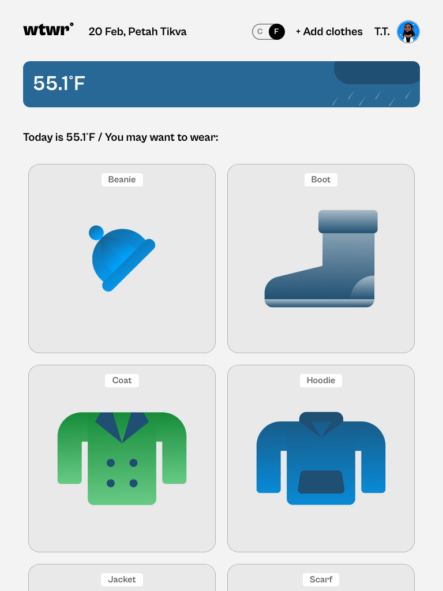
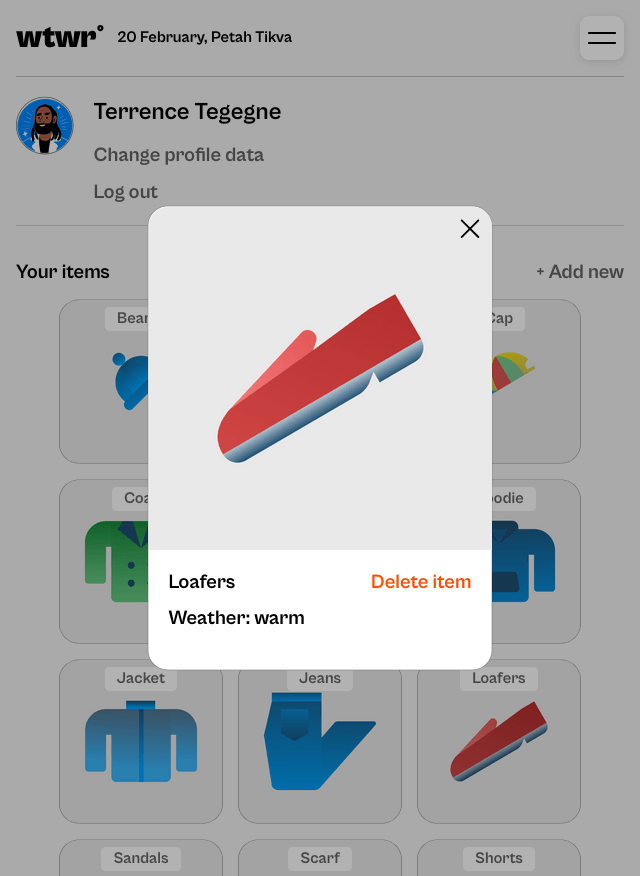
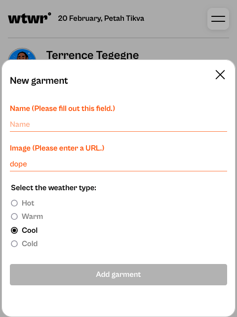

# WTWR (What to Wear?)

This is Project 4 of [TripleTen](https://tripleten.co.il)'s Software/Full-Stack Engineering course.

## About the project

The idea of the application is pretty simple - we make a call to an API, which then responds with the daily weather forecast. We collect the weather data, process it, and then based on the forecast, we recommend suitable clothing to the user.

## Features

- React + Vite frameworks
- Functional components; state and effect hooks
- BEM methodology + flat file structure
- Semantic HTML5
- CSS3
- JS combined with JSX
- Flexbox
- Grid layout
- API weather + time
- Responsive layout w/ Media queries
- Form validation
- React Router w/ a couple of pages
- React Context w/ interchangeable temperatures
- Mock server API (only available locally)
- (coming soon) Animations & Transitions

## Previews

### [Website link (currently not up-to-date)](https://pragmaticludusian.github.io/se_project_react/)

### Desktop

### Mobile

## Links

- [Figma Design I](https://www.figma.com/design/F03bTb81Pw8IDPj5Y9rc5i/Sprint-10-%7C-WTWR?node-id=311-433&p=f&t=EH2TTo3x4AdNfbX6-0)
  - [Alternate albeit outdated link](https://www.figma.com/file/DTojSwldenF9UPKQZd6RRb/Sprint-10%3A-WTWR)
- [OpenWeather API](https://openweather.org/)
- [Figma Design II](https://www.figma.com/design/dQLJwEKasIdspciJAJrCaf/Sprint-11_-WTWR?node-id=459-703&t=oSG1tg2cnZfSDA4a-0)
